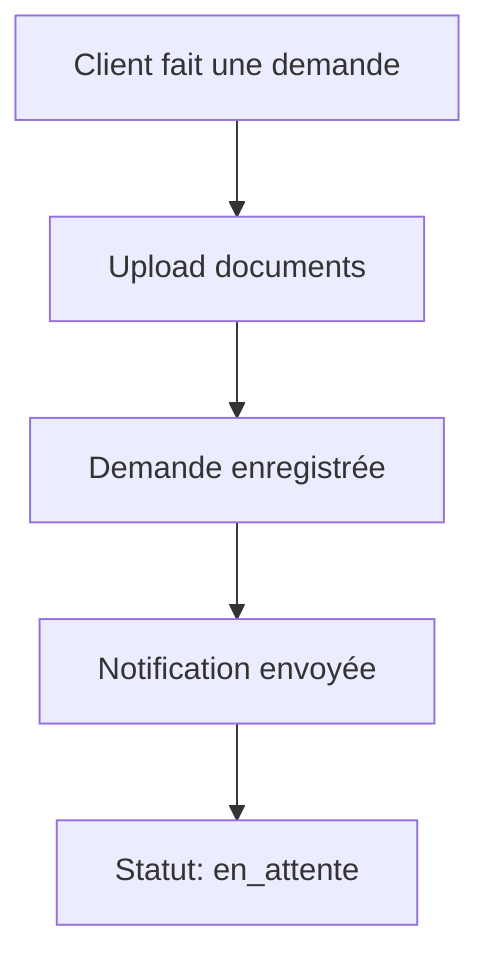
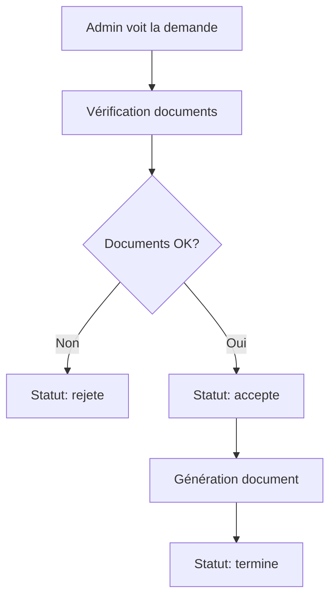
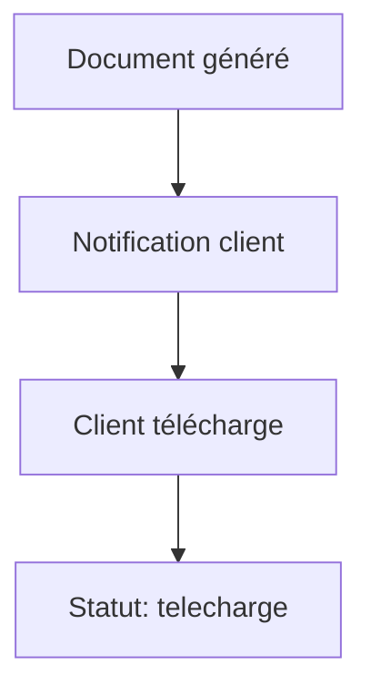

# 📋 Système de Gestion de Documents et Certificats - CCISN

## 🎯 Vue d'ensemble

La CCISN délivre divers documents officiels nécessaires aux entreprises pour leurs activités commerciales nationales et internationales. Ce système permet la gestion complète des demandes, du traitement et de la délivrance de ces documents.

## 📊 Structure de la Base de Données

### 🏢 Modèles Principaux

#### 1. **TypeDocument**

Définit les types de documents disponibles :

- **Certificat d'origine** (15,000 FCFA - 3 jours)
- **Attestation consulaire** (25,000 FCFA - 5 jours)
- **Certificat de conformité** (35,000 FCFA - 7 jours)

```sql
- id: Identifiant unique
- nom: Nom du document
- description: Description détaillée
- documentsRequis: Liste des documents requis (JSON)
- delaiTraitement: Délai en jours ouvrés
- prix: Prix en FCFA
- template: Template HTML/PDF du document
```

#### 2. **DemandeDocument**

Gère les demandes des clients :

```sql
- userId: Référence vers l'utilisateur
- typeDocumentId: Type de document demandé
- nomDemandeur, prenomDemandeur, emailDemandeur: Infos demandeur
- numRegistreCommerce: Numéro de registre de commerce
- statut: en_attente | en_cours | accepte | rejete | termine
- registreCommercePdf: Chemin vers le PDF du registre
- photoIdentite: Chemin vers la photo d'identité
- autresDocuments: Autres documents (JSON)
- commentairesClient: Commentaires du client
```

#### 3. **DocumentGenere**

Documents finalisés et livrables :

```sql
- numeroDocument: Numéro unique (ex: CCISN-CO-1234567890)
- nomFichier: Nom du fichier PDF généré
- cheminFichier: Chemin vers le fichier
- statut: genere | envoye | telecharge
- hashDocument: Hash pour vérification d'intégrité
- qrCode: QR code pour authentification
```

#### 4. **HistoriqueStatut**

Traçabilité des changements de statut :

```sql
- demandeDocumentId: Référence vers la demande
- ancienStatut, nouveauStatut: Changement de statut
- adminId: Administrateur qui a fait le changement
- motif: Raison du changement
```

#### 5. **NotificationDocument**

Notifications pour les utilisateurs :

```sql
- titre, message: Contenu de la notification
- type: info | success | warning | error
- lu: Boolean pour marquer comme lu
```

### 🔧 Modèles Utilitaires

#### **ConfigurationDocument**

Paramètres système :

- `email_admin`: admin@ccisn.ci
- `delai_max_traitement`: 15 jours
- `taille_max_fichier`: 10MB

#### **TemplateEmail**

Templates pour les notifications email :

- `demande_recue`: Confirmation de réception
- `document_pret`: Document prêt à télécharger

#### **JournalAudit**

Journal des actions pour la sécurité et traçabilité.

## 🚀 Fonctionnalités

### 👤 **Partie Client**

#### 1. **Faire une demande**

```javascript
// Étapes de demande :
1. Sélectionner le type de document
2. Remplir les informations personnelles
3. Uploader les documents requis :
   - Registre de commerce (PDF)
   - Photo d'identité
   - Autres documents selon le type
4. Ajouter des commentaires (optionnel)
5. Soumettre la demande
```

#### 2. **Espace client**

- **Tableau de bord** : Vue d'ensemble des demandes
- **Historique** : Toutes les demandes passées
- **Documents** : Téléchargement des documents prêts
- **Notifications** : Alertes sur l'état des demandes

### 👨‍💼 **Partie Admin**

#### 1. **Gestion des demandes**

```javascript
// Workflow admin :
1. Consulter les nouvelles demandes
2. Examiner les documents fournis
3. Changer le statut :
   - "en_cours" : Demande en traitement
   - "accepte" : Documents validés
   - "rejete" : Manque des pièces
4. Ajouter des notes internes
```

#### 2. **Génération de documents**

```javascript
// Processus de génération :
1. Valider toutes les informations
2. Générer le document PDF avec template
3. Ajouter signature numérique et QR code
4. Notifier le client
5. Archiver le document
```

#### 3. **Tableau de bord admin**

- **Statistiques** : Nombre de demandes par période
- **Documents en attente** : Vue prioritaire
- **Revenus** : Suivi des paiements
- **Rapports** : Analyse des performances

## 🔄 Workflow Complet

### Phase 1: Demande Client



### Phase 2: Traitement Admin



### Phase 3: Livraison



## 📱 Interface Utilisateur

### 🎨 **Design Client**

- **Page d'accueil** : Liste des documents disponibles
- **Formulaire de demande** : Interface step-by-step
- **Espace personnel** : Dashboard avec progress tracker
- **Téléchargements** : Gestionnaire de fichiers

### 🛠️ **Interface Admin**

- **Dashboard** : KPIs et métriques
- **File d'attente** : Demandes à traiter
- **Générateur** : Interface de création de documents
- **Paramètres** : Configuration du système

## 🔐 Sécurité et Authentification

### **Niveaux d'accès :**

- **Client** : Ses propres demandes uniquement
- **Admin** : Toutes les demandes + gestion système
- **Super Admin** : Configuration + audit

### **Sécurité des documents :**

- Hash SHA-256 pour vérification d'intégrité
- QR codes pour authentification
- Signature numérique (optionnelle)
- Audit trail complet

## 📊 Types de Documents Supportés

| Document                     | Prix (FCFA) | Délai   | Documents requis                    |
| ---------------------------- | ----------- | ------- | ----------------------------------- |
| **Certificat d'origine**     | 15,000      | 3 jours | RC, Facture, Liste colisage         |
| **Attestation consulaire**   | 25,000      | 5 jours | RC, Photo, Document à légaliser     |
| **Certificat de conformité** | 35,000      | 7 jours | RC, Rapport analyse, Cahier charges |

## 🚀 Prochaines Étapes

### **Phase 1 - Backend API** ✅

- [x] Base de données structurée
- [x] Modèles Prisma
- [x] Tests de validation

### **Phase 2 - API REST**

- [ ] Routes d'authentification
- [ ] CRUD demandes de documents
- [ ] Upload de fichiers
- [ ] Génération de PDF
- [ ] Système de notifications

### **Phase 3 - Interface Vue.js**

- [ ] Pages client (demande, dashboard)
- [ ] Interface admin
- [ ] Composants de upload
- [ ] Système de notifications temps réel

### **Phase 4 - Fonctionnalités Avancées**

- [ ] Paiement en ligne
- [ ] Signature électronique
- [ ] API mobile
- [ ] Intégration comptable

## 🛠️ Technologies Utilisées

- **Backend** : Node.js + Express
- **Base de données** : MySQL + Prisma ORM
- **Frontend** : Vue.js 3 + Composition API
- **Upload** : Multer + Storage cloud
- **PDF** : jsPDF / Puppeteer
- **Notifications** : Socket.io / Server-Sent Events
- **Authentification** : JWT + bcrypt

---

> 📋 **Note** : Cette structure de base de données est maintenant prête pour l'implémentation. Toutes les relations sont correctement définies et testées.
